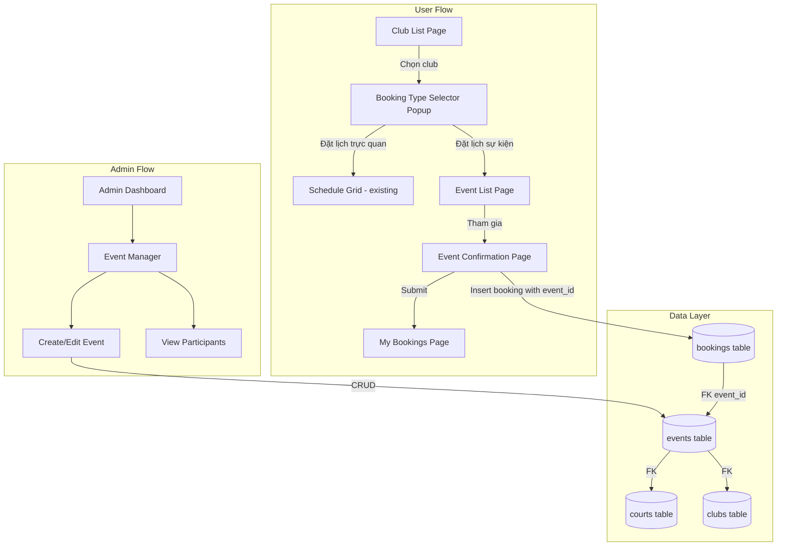

# Design Document: Đặt lịch sự kiện (Event Booking)

## Overview

Tính năng Event Booking mở rộng hệ thống đặt sân hiện tại bằng cách thêm luồng đăng ký sự kiện song song với luồng đặt lịch trực quan (schedule grid). Chủ sân/admin tạo sự kiện trên admin dashboard, user xem và đăng ký tham gia sự kiện qua giao diện mobile-first. Khi đăng ký, hệ thống tạo booking record với status "Sự kiện" và reference tới event_id, tái sử dụng tối đa flow thanh toán/upload bằng chứng hiện có.

## Architecture



## Components and Interfaces

### User-Facing Components

1. **Booking Type Selector** (`src/app/(tabs)/booking/_components/booking-type-selector.tsx`)
   - Dialog/Sheet hiển thị khi user chọn club
   - Hai option: "Đặt lịch trực quan" → navigate to `/dat-san/[slug]`, "Đặt lịch sự kiện" → navigate to `/events/[clubId]`

2. **Event List Page** (`src/app/events/[clubId]/page.tsx`)
   - Hiển thị danh sách sự kiện upcoming của club, filter theo ngày
   - Mỗi event card: tên, ngày, participant count (current/max), sân, giá vé, thể loại, button "Tham gia"
   - Reuse `HorizontalDatePicker` pattern từ booking page

3. **Event Confirmation Page** (`src/app/events/[clubId]/confirm/page.tsx`)
   - Hiển thị thông tin sự kiện
   - Form: tên, số điện thoại, upload bằng chứng thanh toán
   - Reuse pattern từ `src/app/payment/page.tsx` (form schema, upload logic, QR display)

### Admin Components

4. **Event Manager** (`src/app/admin/_components/event-manager.tsx`)
   - CRUD sự kiện cho club owner/admin
   - Form tạo/sửa: tên sự kiện, ngày, sân, max participants, giá vé, thể loại, ghi chú
   - Danh sách sự kiện với filter theo club, status
   - Xem danh sách người tham gia cho mỗi sự kiện
   - Chặn edit sự kiện đã diễn ra

### Shared Utilities

5. **Event Types** (thêm vào `src/lib/types.ts`)
   - `Event` type definition
   - `EventRegistration` extended booking type

### Modified Components

6. **My Bookings Page** (`src/app/(tabs)/my-bookings/page.tsx`)
   - Thêm badge/icon phân biệt booking thường vs sự kiện
   - Hiển thị event name cho booking có status "Sự kiện"

7. **Booking Manager** (`src/app/admin/_components/booking-manager.tsx`)
   - Thêm cột/indicator phân biệt loại booking
   - Thêm filter theo booking type

8. **Admin Dashboard** (`src/app/admin/_components/admin-dashboard.tsx`)
   - Thêm menu item "Sự kiện" cho admin và club_owner

## Data Models

### Events Table (new)

```sql
CREATE TABLE public.events (
  id UUID PRIMARY KEY DEFAULT gen_random_uuid(),
  club_id UUID NOT NULL REFERENCES public.clubs(id) ON DELETE CASCADE,
  event_name TEXT NOT NULL,
  event_date TEXT NOT NULL,          -- YYYY-MM-DD format, consistent with bookings.date
  court_id UUID REFERENCES public.courts(id),
  max_participants INTEGER NOT NULL DEFAULT 10,
  ticket_price NUMERIC NOT NULL DEFAULT 0,
  activity_type TEXT,                -- e.g. "Đánh đôi", "Đánh đơn", "Giao lưu"
  notes TEXT,
  status TEXT NOT NULL DEFAULT 'active'
    CHECK (status IN ('active', 'cancelled', 'completed')),
  created_by UUID REFERENCES auth.users(id),
  created_at TIMESTAMPTZ DEFAULT NOW()
);

CREATE INDEX idx_events_club_id ON public.events(club_id);
CREATE INDEX idx_events_event_date ON public.events(event_date);
CREATE INDEX idx_events_status ON public.events(status);
```

### Bookings Table (modified)

Thêm column `event_id` vào bảng bookings hiện tại:

```sql
ALTER TABLE public.bookings ADD COLUMN event_id UUID REFERENCES public.events(id);
CREATE INDEX idx_bookings_event_id ON public.bookings(event_id);
```

Booking records cho sự kiện sẽ có:
- `status = 'Sự kiện'` (đã có trong type definition hiện tại)
- `event_id` reference tới event
- `slots` chứa court/time info từ event
- `total_price` = ticket_price của event

### TypeScript Types

```typescript
// Thêm vào src/lib/types.ts
export type Event = {
  id: string;
  club_id: string;
  event_name: string;
  event_date: string;
  court_id?: string;
  max_participants: number;
  ticket_price: number;
  activity_type?: string;
  notes?: string;
  status: 'active' | 'cancelled' | 'completed';
  created_by?: string;
  created_at?: string;
};

// Extend UserBooking (đã có event_id-compatible structure)
// Thêm optional field:
// event_id?: string;
// event_name?: string; (denormalized for display)
```

### Participant Count Query

```sql
-- Count active participants for an event
SELECT COUNT(*) as participant_count
FROM public.bookings
WHERE event_id = $1
  AND status != 'Đã hủy'
  AND is_deleted = false;
```


## Correctness Properties

*A property is a characteristic or behavior that should hold true across all valid executions of a system — essentially, a formal statement about what the system should do. Properties serve as the bridge between human-readable specifications and machine-verifiable correctness guarantees.*

### Property 1: Event filtering returns correct club and date range

*For any* set of events across multiple clubs and dates, filtering by a specific club_id and date should return only events belonging to that club with event_date matching the selected date, and no events from other clubs or other dates.

**Validates: Requirements 2.1**

### Property 2: Event display contains all required information

*For any* valid Event object, rendering the event card should produce output containing: event_name, event_date, participant count in "current/max" format, court name, ticket_price, and activity_type.

**Validates: Requirements 2.2, 3.1**

### Property 3: Full events disable registration

*For any* event where the current participant count equals or exceeds max_participants, the registration button should be disabled (isEventFull returns true).

**Validates: Requirements 2.3**

### Property 4: Only future or today events are displayed

*For any* set of events with various dates, the event list filter should return only events where event_date >= today's date, and exclude all events with past dates.

**Validates: Requirements 2.4**

### Property 5: Event registration creates correct booking record

*For any* valid event registration (valid name, phone, event_id), the created booking record should have: status = "Sự kiện", event_id matching the event, total_price matching the event's ticket_price, and club_id matching the event's club_id.

**Validates: Requirements 3.4, 7.2**

### Property 6: Registration form rejects invalid inputs

*For any* registration form submission where name is empty/whitespace-only OR phone does not match the pattern `^[0-9]{10,11}$`, the form validation should reject the submission and return errors.

**Validates: Requirements 3.5**

### Property 7: Event bookings are visually differentiated

*For any* booking with status "Sự kiện", the booking card rendering should include an event-specific indicator (badge/icon) that is absent from bookings with other statuses.

**Validates: Requirements 4.1, 4.2**

### Property 8: Event creation requires all mandatory fields

*For any* event creation attempt missing one or more of: event_name, event_date, court_id, max_participants, ticket_price, activity_type — the validation should reject the submission.

**Validates: Requirements 5.2**

### Property 9: Event editability depends on event date

*For any* event, if event_date is in the future or today, editing should be allowed. If event_date is in the past, editing should be blocked. The function `isEventEditable(event)` should return true if and only if event_date >= today.

**Validates: Requirements 5.3, 5.4**

### Property 10: Past events are automatically cancelled

*For any* event with status "active" and event_date < today, running the auto-cancel process should set the event's status to "cancelled".

**Validates: Requirements 5.5**

### Property 11: Booking type filter works correctly

*For any* set of bookings containing both visual bookings and event registrations, filtering by type "event" should return only bookings with status "Sự kiện", and filtering by type "visual" should return only bookings without status "Sự kiện".

**Validates: Requirements 6.3**

### Property 12: Participant count excludes cancelled registrations

*For any* event with N total booking records where K have status "Đã hủy" or is_deleted = true, the participant count should equal N - K.

**Validates: Requirements 7.3**

## Error Handling

| Scenario | Handling |
|---|---|
| Event not found | Hiển thị thông báo "Sự kiện không tồn tại" và redirect về club list |
| Event full (max participants reached) | Disable button "Tham gia", hiển thị badge "Đã đầy" |
| Upload payment proof fails | Toast error, cho phép retry, không block form submission |
| Event registration insert fails | Toast error "Không thể đăng ký sự kiện", giữ form state |
| Club has no events | Hiển thị empty state "Chưa có sự kiện nào" |
| Event already cancelled/completed | Ẩn button "Tham gia", hiển thị status badge |
| Invalid form data | Inline validation errors (Zod + react-hook-form) |
| Auto-cancel cron fails | Log error, retry on next cron run |

## Testing Strategy

### Property-Based Testing

- Library: **fast-check** (JavaScript/TypeScript PBT library)
- Minimum 100 iterations per property test
- Each test tagged with: `Feature: event-booking, Property {N}: {title}`

### Unit Tests

- Event filtering logic (by club, date, status)
- Form validation (name, phone, required fields)
- Participant count calculation
- Event editability check
- Booking type differentiation logic
- Auto-cancel logic

### Integration Tests

- Event creation → event list display
- Event registration → booking record creation
- Admin event management CRUD operations

### Test File Structure

```
src/lib/__tests__/
  event-utils.test.ts          # Unit tests for event utility functions
  event-utils.property.test.ts # Property-based tests

src/app/events/[clubId]/__tests__/
  event-list.test.ts           # Component tests

src/app/admin/_components/__tests__/
  event-manager.test.ts        # Admin component tests
```
