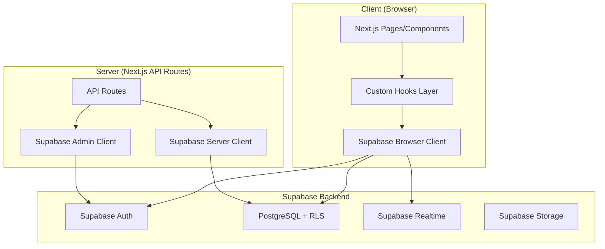
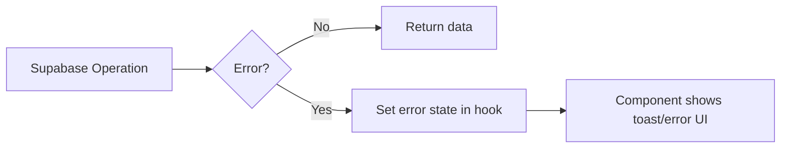

# Design Document: Firebase to Supabase Migration

## Overview

Hệ thống hiện tại sử dụng Firebase (Auth, Firestore, Storage) làm backend cho ứng dụng đặt sân cầu lông Next.js. Migration sang Supabase sẽ thay thế:

- **Firebase Auth** → Supabase Auth (email/password, giữ format `{phone}@badminton.vn`)
- **Firestore** → PostgreSQL via Supabase client
- **Firestore Security Rules** → Row Level Security (RLS) policies
- **Firestore real-time listeners** → Supabase Realtime (postgres_changes)
- **Firebase Storage** → Supabase Storage (cho file uploads tương lai; hiện tại dùng Cloudinary)

Chiến lược migration: thay thế từng layer từ dưới lên - setup client → schema → RLS → hooks → pages.

## Architecture



### Client Architecture

Sử dụng `@supabase/ssr` package với 2 loại client:

1. **Browser Client** (`createBrowserClient`): Dùng trong client components, tự động quản lý cookies
2. **Server Client** (`createServerClient`): Dùng trong Server Components, API Routes, Middleware

### Provider Pattern

Thay thế `FirebaseClientProvider` bằng `SupabaseProvider`:

```typescript
// src/supabase/client.ts
import { createBrowserClient } from '@supabase/ssr'

export function createClient() {
  return createBrowserClient(
    process.env.NEXT_PUBLIC_SUPABASE_URL!,
    process.env.NEXT_PUBLIC_SUPABASE_ANON_KEY!
  )
}
```

```typescript
// src/supabase/server.ts
import { createServerClient } from '@supabase/ssr'
import { cookies } from 'next/headers'

export async function createClient() {
  const cookieStore = await cookies()
  return createServerClient(
    process.env.NEXT_PUBLIC_SUPABASE_URL!,
    process.env.NEXT_PUBLIC_SUPABASE_ANON_KEY!,
    {
      cookies: {
        getAll() { return cookieStore.getAll() },
        setAll(cookiesToSet) {
          cookiesToSet.forEach(({ name, value, options }) =>
            cookieStore.set(name, value, options)
          )
        },
      },
    }
  )
}
```

## Components and Interfaces

### 1. Supabase Provider (`src/supabase/provider.tsx`)

```typescript
interface SupabaseContextType {
  supabase: SupabaseClient
}

// Context + Provider component
// Replaces: FirebaseProvider, useFirebaseApp, useAuth, useFirestore, useStorage
// New hook: useSupabase() → returns SupabaseClient
```

### 2. Auth Hook (`src/supabase/auth/use-user.tsx`)

```typescript
function useUser(): {
  user: User | null
  loading: boolean
}
// Replaces: src/firebase/auth/use-user.tsx
// Uses: supabase.auth.onAuthStateChange()
```

### 3. Query Hook (`src/supabase/hooks/use-query.tsx`)

```typescript
function useSupabaseQuery<T>(
  table: string | null,
  queryBuilder?: (query: PostgrestFilterBuilder) => PostgrestFilterBuilder,
  options?: { realtime?: boolean }
): { data: T[] | null; loading: boolean; error: Error | null }
// Replaces: useCollection from Firebase
// Supports: filtering, ordering, realtime subscriptions
```

### 4. Row Hook (`src/supabase/hooks/use-row.tsx`)

```typescript
function useSupabaseRow<T>(
  table: string | null,
  id: string | null
): { data: T | null; loading: boolean; error: Error | null }
// Replaces: useDoc from Firebase
// Fetches single row by ID
```

### 5. Admin API Route (`src/app/api/admin/create-user/route.ts`)

```typescript
// Server-side route using Supabase Admin client (service_role key)
// For creating staff/club_owner accounts from admin dashboard
// Replaces: Firebase Admin SDK createUser in client-side code
```

### 6. Phone-to-Email Utility (`src/lib/auth-utils.ts`)

```typescript
const DOMAIN = 'badminton.vn'

function phoneToEmail(phone: string): string {
  return `${phone}@${DOMAIN}`
}

function emailToPhone(email: string): string {
  return email.replace(`@${DOMAIN}`, '')
}
// Pure utility functions used by auth operations
```

## Data Models

### PostgreSQL Schema

```sql
-- Users table (synced with Supabase Auth)
CREATE TABLE public.users (
  id UUID PRIMARY KEY REFERENCES auth.users(id) ON DELETE CASCADE,
  email TEXT,
  phone TEXT,
  role TEXT NOT NULL DEFAULT 'customer'
    CHECK (role IN ('admin', 'club_owner', 'staff', 'customer')),
  managed_club_ids UUID[] DEFAULT '{}',
  is_locked BOOLEAN DEFAULT FALSE,
  created_at TIMESTAMPTZ DEFAULT NOW()
);

-- Clubs table
CREATE TABLE public.clubs (
  id UUID PRIMARY KEY DEFAULT gen_random_uuid(),
  name TEXT NOT NULL,
  address TEXT,
  phone TEXT,
  rating NUMERIC,
  image_urls TEXT[] DEFAULT '{}',
  pricing JSONB DEFAULT '{}',
  operating_hours TEXT,
  services_html TEXT,
  latitude DOUBLE PRECISION,
  longitude DOUBLE PRECISION,
  club_type TEXT,
  is_active BOOLEAN DEFAULT TRUE,
  payment_qr_url TEXT,
  price_list_html TEXT,
  price_list_image_url TEXT,
  map_video_url TEXT,
  verification_status TEXT DEFAULT 'approved',
  owner_name TEXT,
  owner_phone TEXT,
  number_of_courts INTEGER,
  description TEXT,
  owner_id UUID REFERENCES auth.users(id),
  created_at TIMESTAMPTZ DEFAULT NOW()
);

-- Courts table (replaces Firestore subcollection clubs/{id}/courts)
CREATE TABLE public.courts (
  id UUID PRIMARY KEY DEFAULT gen_random_uuid(),
  club_id UUID NOT NULL REFERENCES public.clubs(id) ON DELETE CASCADE,
  name TEXT NOT NULL,
  description TEXT,
  image_urls TEXT[] DEFAULT '{}',
  "order" INTEGER DEFAULT 0,
  created_at TIMESTAMPTZ DEFAULT NOW()
);

-- Bookings table
CREATE TABLE public.bookings (
  id UUID PRIMARY KEY DEFAULT gen_random_uuid(),
  user_id UUID REFERENCES auth.users(id),
  club_id UUID NOT NULL REFERENCES public.clubs(id),
  club_name TEXT,
  date TEXT NOT NULL,
  slots JSONB NOT NULL DEFAULT '[]',
  total_price NUMERIC DEFAULT 0,
  status TEXT NOT NULL DEFAULT 'Chờ xác nhận',
  name TEXT,
  phone TEXT,
  payment_proof_image_urls TEXT[] DEFAULT '{}',
  created_at TIMESTAMPTZ DEFAULT NOW(),
  is_deleted BOOLEAN DEFAULT FALSE,
  booking_group_id TEXT
);

-- News table
CREATE TABLE public.news (
  id UUID PRIMARY KEY DEFAULT gen_random_uuid(),
  title TEXT NOT NULL,
  short_description TEXT,
  content_html TEXT,
  banner_image_url TEXT,
  tags TEXT[] DEFAULT '{}',
  created_at TIMESTAMPTZ DEFAULT NOW()
);

-- News Tags table
CREATE TABLE public.news_tags (
  id UUID PRIMARY KEY DEFAULT gen_random_uuid(),
  name TEXT NOT NULL
);

-- Club Types table
CREATE TABLE public.club_types (
  id UUID PRIMARY KEY DEFAULT gen_random_uuid(),
  name TEXT NOT NULL,
  "order" INTEGER DEFAULT 0
);
```

### RLS Policies

```sql
-- Enable RLS on all tables
ALTER TABLE public.users ENABLE ROW LEVEL SECURITY;
ALTER TABLE public.clubs ENABLE ROW LEVEL SECURITY;
ALTER TABLE public.courts ENABLE ROW LEVEL SECURITY;
ALTER TABLE public.bookings ENABLE ROW LEVEL SECURITY;
ALTER TABLE public.news ENABLE ROW LEVEL SECURITY;
ALTER TABLE public.news_tags ENABLE ROW LEVEL SECURITY;
ALTER TABLE public.club_types ENABLE ROW LEVEL SECURITY;

-- Helper function to get user role
CREATE OR REPLACE FUNCTION public.get_user_role()
RETURNS TEXT AS $$
  SELECT role FROM public.users WHERE id = auth.uid()
$$ LANGUAGE sql SECURITY DEFINER STABLE;

-- Helper function to check if user is admin
CREATE OR REPLACE FUNCTION public.is_admin()
RETURNS BOOLEAN AS $$
  SELECT public.get_user_role() = 'admin'
$$ LANGUAGE sql SECURITY DEFINER STABLE;

-- Helper function to check if user manages a club
CREATE OR REPLACE FUNCTION public.manages_club(club_uuid UUID)
RETURNS BOOLEAN AS $$
  SELECT EXISTS (
    SELECT 1 FROM public.users
    WHERE id = auth.uid()
      AND role = 'club_owner'
      AND club_uuid = ANY(managed_club_ids)
  )
$$ LANGUAGE sql SECURITY DEFINER STABLE;

-- USERS policies
CREATE POLICY "Users can read own profile" ON public.users
  FOR SELECT USING (auth.uid() = id OR public.is_admin());

CREATE POLICY "Users can update own profile" ON public.users
  FOR UPDATE USING (auth.uid() = id OR public.is_admin());

CREATE POLICY "Admins can insert users" ON public.users
  FOR INSERT WITH CHECK (public.is_admin() OR auth.uid() = id);

CREATE POLICY "Admins can list all users" ON public.users
  FOR SELECT USING (public.is_admin());

-- CLUBS policies
CREATE POLICY "Public read clubs" ON public.clubs
  FOR SELECT USING (true);

CREATE POLICY "Admins create clubs" ON public.clubs
  FOR INSERT WITH CHECK (
    public.is_admin()
    OR (verification_status = 'pending' AND is_active = false)
  );

CREATE POLICY "Admins or owners update clubs" ON public.clubs
  FOR UPDATE USING (public.is_admin() OR public.manages_club(id));

CREATE POLICY "Admins delete clubs" ON public.clubs
  FOR DELETE USING (public.is_admin());

-- COURTS policies
CREATE POLICY "Public read courts" ON public.courts
  FOR SELECT USING (true);

CREATE POLICY "Admins or owners manage courts" ON public.courts
  FOR ALL USING (public.is_admin() OR public.manages_club(club_id));

-- BOOKINGS policies
CREATE POLICY "Public read bookings" ON public.bookings
  FOR SELECT USING (true);

CREATE POLICY "Anyone can create bookings" ON public.bookings
  FOR INSERT WITH CHECK (true);

CREATE POLICY "Admins or owners update bookings" ON public.bookings
  FOR UPDATE USING (public.is_admin() OR public.manages_club(club_id));

CREATE POLICY "Admins or owners delete bookings" ON public.bookings
  FOR DELETE USING (public.is_admin() OR public.manages_club(club_id));

-- NEWS policies
CREATE POLICY "Public read news" ON public.news
  FOR SELECT USING (true);

CREATE POLICY "Admins manage news" ON public.news
  FOR ALL USING (public.is_admin());

-- NEWS_TAGS policies
CREATE POLICY "Public read news_tags" ON public.news_tags
  FOR SELECT USING (true);

CREATE POLICY "Admins manage news_tags" ON public.news_tags
  FOR ALL USING (public.is_admin());

-- CLUB_TYPES policies
CREATE POLICY "Public read club_types" ON public.club_types
  FOR SELECT USING (true);

CREATE POLICY "Admins manage club_types" ON public.club_types
  FOR ALL USING (public.is_admin());
```

### TypeScript Types (Updated)

```typescript
// src/lib/types.ts - Key changes:
// 1. Remove: import { Timestamp } from 'firebase/firestore'
// 2. Replace Timestamp with string for createdAt fields
// 3. All IDs remain string (UUID format)

export type UserBooking = {
  id: string;
  user_id?: string;      // snake_case to match DB
  club_id: string;
  club_name: string;
  date: string;
  slots: SelectedSlot[];
  total_price: number;
  status: 'Đã xác nhận' | 'Chờ xác nhận' | 'Đã hủy' | 'Khóa' | 'Sự kiện';
  name: string;
  phone: string;
  payment_proof_image_urls?: string[];
  created_at?: string;    // ISO 8601 string
  is_deleted?: boolean;
  booking_group_id?: string;
};

// Similar snake_case updates for all other types...
```

### Mapping: Firestore → Supabase Queries

| Firestore Pattern | Supabase Equivalent |
|---|---|
| `useCollection('clubs')` | `useSupabaseQuery('clubs')` |
| `useDoc('clubs/id')` | `useSupabaseRow('clubs', id)` |
| `useCollection('clubs/id/courts')` | `useSupabaseQuery('courts', q => q.eq('club_id', id))` |
| `query(where('date','==',d), where('clubId','==',c))` | `q => q.eq('date', d).eq('club_id', c)` |
| `query(orderBy('createdAt','desc'))` | `q => q.order('created_at', { ascending: false })` |
| `addDoc(collection, data)` | `supabase.from(table).insert(data)` |
| `updateDoc(doc, data)` | `supabase.from(table).update(data).eq('id', id)` |
| `deleteDoc(doc)` | `supabase.from(table).delete().eq('id', id)` |
| `setDoc(doc, data, {merge})` | `supabase.from(table).upsert(data)` |
| `writeBatch()` | `supabase.from(table).insert([...rows])` |
| `serverTimestamp()` | Handled by DB default `NOW()` |
| `onSnapshot()` | `supabase.channel().on('postgres_changes', ...).subscribe()` |


## Correctness Properties

*A property is a characteristic or behavior that should hold true across all valid executions of a system — essentially, a formal statement about what the system should do. Properties serve as the bridge between human-readable specifications and machine-verifiable correctness guarantees.*

### Property 1: Phone-to-email transformation is reversible

*For any* valid phone number string (10-11 digits), converting it to email format via `phoneToEmail()` and then extracting the phone back via `emailToPhone()` should produce the original phone number. This is a round-trip property.

**Validates: Requirements 2.1, 2.2**

### Property 2: Public tables are readable without authentication

*For any* row in the `clubs`, `news`, `news_tags`, `club_types`, or `bookings` tables, an unauthenticated Supabase client should be able to read that row.

**Validates: Requirements 4.1, 4.2**

### Property 3: User profile access is restricted to owner or admin

*For any* user profile in the `users` table, only the user themselves (matching `auth.uid()`) or a user with role 'admin' should be able to read or update that profile.

**Validates: Requirements 4.3**

### Property 4: Anyone can create a booking

*For any* valid booking data, both authenticated and unauthenticated clients should be able to insert a row into the `bookings` table.

**Validates: Requirements 4.5**

### Property 5: Booking management restricted to admins and club owners

*For any* booking in the `bookings` table, only a user with role 'admin' or a club_owner whose `managed_club_ids` contains the booking's `club_id` should be able to update or delete that booking.

**Validates: Requirements 4.6**

### Property 6: Admin-only write access for content tables

*For any* write operation (insert, update, delete) on `news`, `news_tags`, or `club_types` tables, only a user with role 'admin' should be able to perform the operation.

**Validates: Requirements 4.7**

### Property 7: Courts filtered by club_id return correct results

*For any* club_id, querying the `courts` table with filter `club_id = X` should return only courts where `club_id` equals X.

**Validates: Requirements 6.3**

### Property 8: News articles are returned in descending created_at order

*For any* set of news articles returned by the news query, each article's `created_at` should be greater than or equal to the next article's `created_at`.

**Validates: Requirements 8.1**

### Property 9: News tag filtering returns only matching articles

*For any* tag filter value, all returned news articles should have that tag in their `tags` array.

**Validates: Requirements 8.2**

### Property 10: User bookings query returns only that user's bookings

*For any* user_id, querying bookings with filter `user_id = X` should return only bookings where `user_id` equals X.

**Validates: Requirements 9.2**

## Error Handling

### Strategy

Thay thế hệ thống error handling hiện tại (FirestorePermissionError + errorEmitter) bằng cách xử lý lỗi Supabase trực tiếp:

1. **Supabase errors**: Supabase client trả về `{ data, error }` thay vì throw exceptions. Mỗi hook sẽ expose `error` state.

2. **Auth errors**: Map Supabase auth error codes sang thông báo tiếng Việt:
   - `invalid_credentials` → "Số điện thoại hoặc mật khẩu không chính xác"
   - `user_already_exists` → "Tài khoản đã tồn tại"
   - `weak_password` → "Mật khẩu quá yếu"

3. **RLS errors**: Khi RLS từ chối truy cập, Supabase trả về empty result (SELECT) hoặc error (INSERT/UPDATE/DELETE). Hooks sẽ handle gracefully.

4. **Network errors**: Supabase client tự retry. Hooks sẽ show loading state trong khi retry.

### Error Flow



### Xóa bỏ

- Xóa `src/firebase/error-emitter.ts`
- Xóa `src/firebase/errors.ts`
- Xóa `src/components/FirebaseErrorListener.tsx`

## Testing Strategy

### Approach

Do đây là migration project (thay thế backend, giữ nguyên UX), testing tập trung vào:

1. **Unit tests**: Kiểm tra các utility functions (phone-to-email transformation)
2. **Property-based tests**: Kiểm tra correctness properties cho data access patterns và RLS
3. **Integration tests**: Kiểm tra hooks hoạt động đúng với Supabase client

### Testing Framework

- **Unit & Integration**: Vitest (đã có sẵn trong Next.js ecosystem)
- **Property-based testing**: `fast-check` library
- Minimum 100 iterations per property test

### Test Structure

```
src/
  __tests__/
    auth-utils.test.ts          # Unit + Property tests for phone-to-email
    hooks/
      use-query.test.ts         # Hook behavior tests
      use-row.test.ts           # Hook behavior tests
    rls/
      rls-policies.test.ts      # RLS policy property tests (requires Supabase connection)
```

### Property Test Annotations

Each property test must include a comment referencing the design property:
```typescript
// Feature: firebase-to-supabase-migration, Property 1: Phone-to-email transformation is reversible
```
