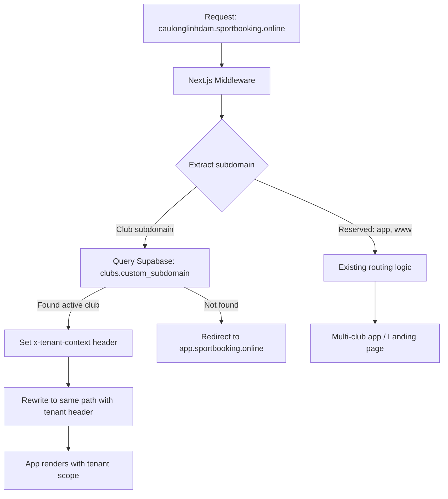

# Design Document: Multi-Tenant Subdomain

## Overview

Hệ thống multi-tenant subdomain mở rộng ứng dụng Sport Booking hiện tại để hỗ trợ subdomain riêng cho từng câu lạc bộ. Kiến trúc dựa trên Next.js middleware để phân giải subdomain thành tenant context, sau đó truyền context này qua request headers cho toàn bộ ứng dụng.

Approach chính:
- Middleware extract subdomain từ hostname, query database để tìm club tương ứng
- Tenant context được serialize thành JSON header `x-tenant-context` và truyền qua `NextResponse.rewrite()`
- Server components và API routes đọc header này để scope data
- Vercel wildcard domain `*.sportbooking.online` cho phép mọi subdomain trỏ về cùng deployment
- Admin UI thêm field `custom_subdomain` trong club form

## Architecture



### Request Flow

1. DNS: `*.sportbooking.online` → Vercel (wildcard CNAME)
2. Vercel routes request to Next.js app
3. Middleware extracts subdomain from `Host` header
4. If subdomain is reserved (app, www, api) → existing logic
5. If subdomain matches a club → set tenant context header, rewrite
6. If subdomain doesn't match → redirect to `app.sportbooking.online`
7. Server components read `x-tenant-context` header via `headers()` API
8. Data queries filter by `club_id` from tenant context

### Caching Strategy for Subdomain Resolution

Middleware chạy trên mỗi request, nên cần tối ưu database lookup:
- Sử dụng Supabase query trực tiếp với unique index trên `custom_subdomain` (fast lookup)
- Middleware chỉ query 2 fields: `id` và `name` để giảm payload
- Trong tương lai có thể thêm Vercel Edge Config hoặc KV cache nếu cần

## Components and Interfaces

### 1. Tenant Context Module (`src/lib/tenant.ts`)

```typescript
export interface TenantContext {
  clubId: string;
  clubName: string;
  subdomain: string;
}

// Serialize tenant context to JSON string for header
export function serializeTenantContext(ctx: TenantContext): string;

// Deserialize tenant context from JSON header value
export function deserializeTenantContext(headerValue: string): TenantContext | null;

// Read tenant context from request headers (server-side)
export function getTenantContext(): TenantContext | null;

// Check if a subdomain is reserved
export function isReservedSubdomain(subdomain: string): boolean;

// Validate subdomain format
export function isValidSubdomain(value: string): boolean;
```

### 2. Enhanced Middleware (`src/middleware.ts`)

Mở rộng middleware hiện tại thêm logic:

```typescript
// Pseudocode
function middleware(request) {
  hostname = request.headers.get('host')
  subdomain = extractSubdomain(hostname, 'sportbooking.online')
  
  if (!subdomain || isReservedSubdomain(subdomain)) {
    // Existing routing logic (unchanged)
    return existingMiddlewareLogic(request)
  }
  
  // Lookup club by subdomain
  club = await supabase.from('clubs')
    .select('id, name')
    .eq('custom_subdomain', subdomain)
    .eq('is_active', true)
    .single()
  
  if (!club) {
    return redirect('https://app.sportbooking.online')
  }
  
  // Set tenant context header and rewrite
  tenantContext = { clubId: club.id, clubName: club.name, subdomain }
  response = NextResponse.rewrite(request.nextUrl)
  response.headers.set('x-tenant-context', serialize(tenantContext))
  return response
}
```

### 3. Supabase Client for Middleware (`src/supabase/middleware.ts`)

Middleware cần lightweight Supabase client (không dùng auth, chỉ query):

```typescript
import { createClient } from '@supabase/supabase-js';

export function createMiddlewareSupabaseClient() {
  return createClient(
    process.env.NEXT_PUBLIC_SUPABASE_URL!,
    process.env.NEXT_PUBLIC_SUPABASE_ANON_KEY!
  );
}
```

### 4. Tenant-Aware Layout Components

**Header Component** (`src/components/header.tsx`):
- Đọc tenant context
- Hiển thị club name thay vì "Sport Booking" khi có tenant
- Hiển thị club logo khi available

**Bottom Nav** (`src/components/bottom-nav.tsx`):
- Khi có tenant, ẩn tab "Đặt sân" (club selection) vì đã scope sẵn
- Hoặc redirect trực tiếp đến booking page của club

### 5. Admin Subdomain Configuration

**Club Form Dialog** (`src/app/admin/_components/club-manager.tsx`):
- Thêm field `custom_subdomain` vào form
- Validation: lowercase alphanumeric + hyphens, max 63 chars
- Check unique via Supabase query trước khi save
- Check reserved subdomains
- Preview URL: `{subdomain}.sportbooking.online`

**Schema Update** (`src/app/admin/_components/schemas.ts`):
```typescript
// Add to clubSchema
customSubdomain: z.string()
  .regex(/^[a-z0-9]([a-z0-9-]*[a-z0-9])?$/, 'Subdomain chỉ chứa chữ thường, số và dấu gạch ngang')
  .max(63, 'Subdomain tối đa 63 ký tự')
  .optional()
  .or(z.literal(''))
```

### 6. Tenant-Scoped Data Hooks

**Custom Hook** (`src/hooks/use-tenant.ts`):
```typescript
// Client-side hook to get tenant context
// Reads from a React context provider that's populated server-side
export function useTenant(): TenantContext | null;
```

**Tenant Provider** (`src/components/tenant-provider.tsx`):
```typescript
// Server component reads header, passes to client context
export function TenantProvider({ children, tenant }: { 
  children: React.ReactNode; 
  tenant: TenantContext | null 
});
```

## Data Models

### Database Migration: `custom_subdomain` column

```sql
-- Add custom_subdomain column to clubs table
ALTER TABLE public.clubs 
  ADD COLUMN IF NOT EXISTS custom_subdomain TEXT;

-- Unique constraint (only on non-null values)
CREATE UNIQUE INDEX IF NOT EXISTS idx_clubs_custom_subdomain 
  ON public.clubs(custom_subdomain) 
  WHERE custom_subdomain IS NOT NULL;

-- Check constraint for format validation
ALTER TABLE public.clubs 
  ADD CONSTRAINT chk_custom_subdomain_format 
  CHECK (
    custom_subdomain IS NULL 
    OR (
      custom_subdomain ~ '^[a-z0-9]([a-z0-9-]*[a-z0-9])?$' 
      AND length(custom_subdomain) <= 63
    )
  );
```

### Updated Club Type

```typescript
export type Club = {
  // ... existing fields
  custom_subdomain?: string | null;
};
```

### TenantContext Type

```typescript
export interface TenantContext {
  clubId: string;      // UUID of the club
  clubName: string;    // Display name
  subdomain: string;   // The subdomain value
}
```

### Reserved Subdomains List

```typescript
const RESERVED_SUBDOMAINS = [
  'app', 'www', 'api', 'admin', 'mail', 'ftp', 
  'staging', 'dev', 'test', 'beta', 'demo',
  'static', 'cdn', 'assets', 'img', 'images',
  'ns1', 'ns2', 'dns', 'mx',
] as const;
```


## Correctness Properties

*A property is a characteristic or behavior that should hold true across all valid executions of a system — essentially, a formal statement about what the system should do. Properties serve as the bridge between human-readable specifications and machine-verifiable correctness guarantees.*

### Property 1: Subdomain extraction correctness

*For any* hostname string of the form `{subdomain}.sportbooking.online`, the `extractSubdomain` function should return exactly the `{subdomain}` portion. For hostnames without a subdomain prefix (e.g., `sportbooking.online`), it should return `null`.

**Validates: Requirements 1.1**

### Property 2: Reserved subdomain exclusion

*For any* subdomain in the reserved list (app, www, api, admin, mail, ftp, staging, dev, test, beta, demo, static, cdn, assets, img, images, ns1, ns2, dns, mx), the `isReservedSubdomain` function should return `true`, and for any subdomain NOT in the reserved list, it should return `false`.

**Validates: Requirements 1.4**

### Property 3: Subdomain format validation

*For any* string, the `isValidSubdomain` function should return `true` if and only if the string matches `^[a-z0-9]([a-z0-9-]*[a-z0-9])?$` and has length ≤ 63. Strings with uppercase, special characters, leading/trailing hyphens, or exceeding 63 characters should be rejected.

**Validates: Requirements 2.1, 5.2**

### Property 4: Subdomain uniqueness enforcement

*For any* two distinct clubs, if both have a non-null `custom_subdomain`, their subdomain values must be different. The database unique constraint ensures this invariant holds after any insert or update operation.

**Validates: Requirements 2.2**

### Property 5: Tenant context serialization round-trip

*For any* valid `TenantContext` object (with non-empty clubId, clubName, and subdomain), serializing it to a JSON string and then deserializing it back should produce an object equivalent to the original.

**Validates: Requirements 7.3**

### Property 6: Tenant data scoping

*For any* tenant context with a club ID, all data returned by tenant-scoped queries (courts, bookings, schedules) should belong exclusively to that club. No data from other clubs should appear in the results.

**Validates: Requirements 3.1, 4.1**

## Error Handling

| Scenario | Handling |
|---|---|
| Unknown subdomain (no matching club) | Redirect to `app.sportbooking.online` |
| Inactive club subdomain | Redirect to `app.sportbooking.online` (same as unknown) |
| Malformed `x-tenant-context` header | `deserializeTenantContext` returns `null`, app falls back to multi-club mode |
| Database query failure in middleware | Log error, allow request to proceed without tenant context (graceful degradation) |
| Duplicate subdomain on save | Supabase unique constraint error → display user-friendly error in admin form |
| Reserved subdomain on save | Client-side validation rejects before API call |
| Invalid subdomain format on save | Zod schema validation rejects in form, database CHECK constraint as backup |

## Testing Strategy

### Property-Based Testing

Library: **fast-check** (TypeScript PBT library)

Mỗi property test chạy tối thiểu 100 iterations với random inputs.

| Property | Test Approach |
|---|---|
| P1: Subdomain extraction | Generate random valid subdomains, construct hostnames, verify extraction |
| P2: Reserved subdomain exclusion | Generate strings from reserved list and random non-reserved strings |
| P3: Subdomain format validation | Generate random strings (valid and invalid patterns), verify against regex |
| P4: Subdomain uniqueness | Tested via database constraint (integration test) |
| P5: Tenant context round-trip | Generate random TenantContext objects, serialize/deserialize, compare |
| P6: Tenant data scoping | Generate random club IDs, verify query filtering (integration test) |

Properties P1, P2, P3, P5 are pure function tests — ideal for property-based testing.
Properties P4, P6 require database interaction — tested as integration tests with specific examples.

### Unit Tests

- Middleware routing logic: test each branch (reserved, club match, no match, localhost)
- Admin form validation: test subdomain field validation
- Tenant provider: test context propagation

### Tag Format

Mỗi property test được annotate:
```
// Feature: multi-tenant-subdomain, Property {N}: {title}
```
