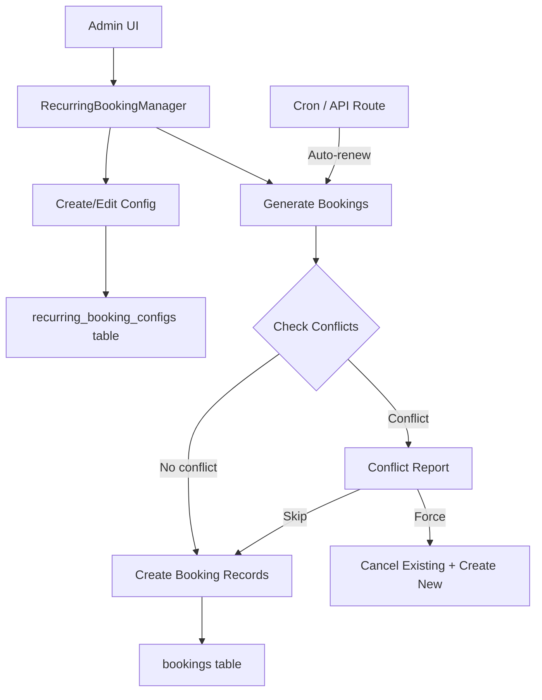

# Design Document: Recurring Monthly Booking

## Overview

Tính năng cho phép admin/chủ sân tạo cấu hình lịch đặt sân cố định lặp lại theo tuần trong một tháng. Hệ thống sẽ generate các booking records dựa trên cấu hình, tích hợp vào hệ thống booking hiện tại (bảng `bookings`), và hỗ trợ cả tạo thủ công lẫn tự động.

## Architecture

Tính năng được xây dựng trên kiến trúc hiện tại:
- Frontend: Next.js component trong admin dashboard (`_components/recurring-booking-manager.tsx`)
- Backend: Supabase (PostgreSQL) cho storage, Supabase Edge Functions hoặc API route cho auto-generation
- Tích hợp: Sử dụng bảng `bookings` hiện tại để lưu booking đã generate, thêm bảng mới `recurring_booking_configs` cho cấu hình



## Components and Interfaces

### New Component: `RecurringBookingManager`
- Location: `src/app/admin/_components/recurring-booking-manager.tsx`
- Renders in admin dashboard as a new sidebar menu item
- Contains: config list, create/edit form dialog, generate action, conflict dialog

### Core Functions

```typescript
// Tính tất cả ngày trong tháng khớp với day_of_week
function getDatesForDayInMonth(year: number, month: number, dayOfWeek: number): Date[]

// Generate bookings từ config, trả về kết quả + conflicts
async function generateBookingsFromConfig(
  config: RecurringBookingConfig,
  club: Club,
  existingBookings: UserBooking[]
): Promise<GenerationResult>

// Tính giá cho một booking dựa trên slots và pricing
function calculateBookingPrice(
  slots: SelectedSlot[],
  date: Date,
  pricing: Club['pricing']
): number
```

## Data Models

### New Table: `recurring_booking_configs`

```sql
CREATE TABLE recurring_booking_configs (
  id UUID PRIMARY KEY DEFAULT gen_random_uuid(),
  club_id UUID NOT NULL REFERENCES clubs(id) ON DELETE CASCADE,
  customer_name TEXT NOT NULL,
  customer_phone TEXT NOT NULL,
  month TEXT NOT NULL, -- format: yyyy-MM
  schedule_entries JSONB NOT NULL, -- array of ScheduleEntry
  auto_renew BOOLEAN DEFAULT false,
  generation_status TEXT DEFAULT 'pending', -- pending | generated | partially_generated
  is_deleted BOOLEAN DEFAULT false,
  created_at TIMESTAMPTZ DEFAULT now(),
  updated_at TIMESTAMPTZ DEFAULT now()
);
```

### TypeScript Types

```typescript
type ScheduleEntry = {
  day_of_week: number; // 0 = Sunday, 6 = Saturday
  court_id: string;
  court_name: string;
  time_slots: string[]; // e.g. ["20:00", "20:30", "21:00", "21:30"]
};

type RecurringBookingConfig = {
  id: string;
  club_id: string;
  customer_name: string;
  customer_phone: string;
  month: string; // yyyy-MM
  schedule_entries: ScheduleEntry[];
  auto_renew: boolean;
  generation_status: 'pending' | 'generated' | 'partially_generated';
  is_deleted: boolean;
  created_at: string;
  updated_at: string;
};

type ConflictInfo = {
  date: string;
  time: string;
  court_id: string;
  court_name: string;
  existing_booking_name: string;
  existing_booking_phone: string;
};

type GenerationResult = {
  created_count: number;
  skipped_count: number;
  conflicts: ConflictInfo[];
  booking_group_id: string;
};
```


## Correctness Properties

*A property is a characteristic or behavior that should hold true across all valid executions of a system — essentially, a formal statement about what the system should do. Properties serve as the bridge between human-readable specifications and machine-verifiable correctness guarantees.*

### Property 1: Config round-trip persistence
*For any* valid RecurringBookingConfig, saving it to the database and reading it back should produce an equivalent object (same club_id, month, customer_name, customer_phone, schedule_entries, auto_renew).
**Validates: Requirements 1.1, 1.5**

### Property 2: Schedule entry validation rejects invalid inputs
*For any* ScheduleEntry with day_of_week outside 0–6, or with an empty time_slots array, the validation function should reject it. *For any* ScheduleEntry with day_of_week in 0–6 and at least one time slot, validation should accept it.
**Validates: Requirements 1.2**

### Property 3: Month validation rejects past months
*For any* month string in yyyy-MM format, if the month is before the current month, validation should reject it. If the month is the current month or later, validation should accept it.
**Validates: Requirements 1.3**

### Property 4: getDatesForDayInMonth returns correct dates
*For any* valid year, month (1–12), and dayOfWeek (0–6), all returned dates should: (a) fall on the specified dayOfWeek, (b) be within the specified month, and (c) cover all occurrences of that day in the month.
**Validates: Requirements 2.1**

### Property 5: Generated bookings have correct fields and shared group_id
*For any* RecurringBookingConfig and generated bookings, each booking should have status "Đã xác nhận", the config's customer_name and phone, the correct court_id and time slots for its date, and all bookings from the same generation run should share the same booking_group_id.
**Validates: Requirements 2.2, 2.5**

### Property 6: Conflicts are skipped and reported
*For any* generation run where existing bookings overlap with target slots, the overlapping slots should not produce new bookings, and each overlap should appear in the conflict report with the correct date, time, court, and existing booking info.
**Validates: Requirements 2.3, 5.1**

### Property 7: No duplicate bookings
*For any* generation run, no two bookings in the result should share the same court_id, date, and time slot. This includes both newly created bookings and pre-existing ones.
**Validates: Requirements 5.4**

### Property 8: Config mutations don't affect existing bookings
*For any* RecurringBookingConfig that has already generated bookings, editing or soft-deleting the config should not change any field of the already-created bookings.
**Validates: Requirements 4.3, 4.4**

### Property 9: Price calculation matches slot-level pricing
*For any* generated booking, the total_price should equal the sum of getPriceForSlot(time, date, pricing) for each slot in the booking.
**Validates: Requirements 6.1, 6.2**

## Error Handling

- **Invalid config data**: Zod validation on the form, reject before saving
- **Database errors**: Toast notification with error message, no partial state
- **Conflict during generation**: Show conflict dialog, allow skip or force-book
- **Auto-generation failures**: Log to console, create notification record for admin
- **Network errors**: Retry-friendly design, generation is idempotent (check existing before creating)

## Testing Strategy

### Unit Tests
- `getDatesForDayInMonth`: specific examples (e.g., April 2026 Wednesdays = [1, 8, 15, 22, 29])
- `calculateBookingPrice`: specific pricing tier examples
- Validation functions: edge cases (day_of_week = -1, empty month, etc.)

### Property-Based Tests
- Use `fast-check` library for TypeScript property-based testing
- Minimum 100 iterations per property test
- Each test tagged with: **Feature: recurring-monthly-booking, Property {N}: {title}**
- Properties 1–9 as defined above

### Integration Tests
- Full generation flow: create config → generate → verify bookings in DB
- Conflict handling: pre-populate bookings → generate → verify skips
- Force-book: verify old booking cancelled, new one created
